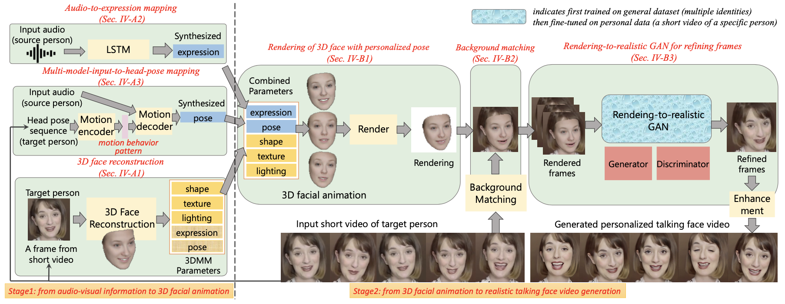

# Predicting Personalized Head Movement from Short Video and Speech Signal

We provide PyTorch implementations for our TMM paper "Predicting Personalized Head Movement from Short Video and Speech Signal"(https://ieeexplore.ieee.org/document/9894719).

Note that this code is protected under patent. It is for research purposes only at your university (research institution) only. If you are interested in business purposes/for-profit use, please contact Prof.Liu (the corresponding author, email: liuyongjin@tsinghua.edu.cn).

We provide a demo video [here](https://ieeexplore.ieee.org/document/9894719/media#media).

## Our Proposed Framework



## Prerequisites
- Linux or macOS
- NVIDIA GPU
- Python 3
- MATLAB

## Getting Started
### Installation
- You can create a virtual env, and install all the dependencies by
```bash
pip install -r requirements.txt
```

### Download pre-trained models
- Including pre-trained general models
- Download from [BaiduYun](https://pan.baidu.com/s/1ckrs6SCkVtsiw4rnTUAzyg)(extract code: r24f) and copy to corresponding subfolders:
  - Put `latest_iddNet.pth` and `latest_cttMotionNet.pth` under `Audio/model/Motion846_contraloss4_autogradhidden_hn_conti_10epochs`.
  - Put `atcnet_lstm_199.pth` under `Audio/model/atcnet_pose01`.
  - Put `0_net_G.pth` under `render-to-video/checkpoints/seq_p2p`.

### Download face model for 3d face reconstruction
- We use the code in [WM3DR](https://github.com/kalyo-zjl/WM3DR) for 3d face reconstruction
- Download the face reconstruction model [final.pth](https://drive.google.com/file/d/1Rx76Q2pkinxY8T5EtGHyc8bqlZhSYWtf/view?usp=sharing) and put it under `WM3DR/model`
- The 3DMM model used in this repo is from [Deep3dPytorch](https://github.com/changhongjian/Deep3DFaceReconstruction-pytorch), you should generate `mSEmTFK68etc.chj` file and put it under `WM3DR/BFM`
- Download [`shape_predictor_68_face_landmarks.dat.bz2`](http://dlib.net/files/shape_predictor_68_face_landmarks.dat.bz2), decompress it, and put it under `Deep3DFaceReconstruction`

### Train on a target peron's short video
- 1. Prepare a talking face video that satisfies: 1) contains a single person, 2) 25 fps, 3) longer than 12 seconds, 4) without large body translation (e.g. move from the left to the right of the screen). Rename the video to [person_id].mp4 (e.g. 1.mp4) and copy to Data subfolder.

Note: You can make a video to 25 fps by 
```bash
ffmpeg -i xxx.mp4 -r 25 xxx.mp4
```
- 2. Preprocess and train
```bash
python train.py --id [person_id] --gpu_id [gpu_id]
```

### Test on a target peron
Place the audio file (.wav or .mp3) for test under `Audio/audio/`.
Run [with generated poses]

```bash
python test.py --id [person_id] --audio [audio_file_name (e.g., 4_00003)] --gpu_id [gpu_id]
```

This program will print 'saved to xxx.mov' if the videos are successfully generated.
It will output 2 movs, one is a video with face only (_full9.mov), the other is a video with background (_transbigbg.mov).


## Acknowledgments
The face reconstruction code is from [Deep3DFaceReconstruction](https://github.com/microsoft/Deep3DFaceReconstruction) and [WM3DR](https://github.com/kalyo-zjl/WM3DR), the arcface code is from [insightface](https://github.com/deepinsight/insightface), the gan code is developed based on [pytorch-CycleGAN-and-pix2pix](https://github.com/junyanz/pytorch-CycleGAN-and-pix2pix).
